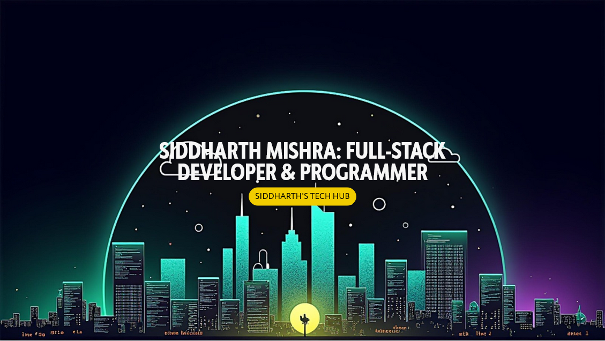

<h1 align="center">Hey there 👋, I'm Siddharth Mishra</h1>

  

---

### 👨‍💻 About Me

- 🚀 Software Engineer with a passion for **systems programming**, **emulation**, and **backend engineering**.
- 🇯🇵 Interned at **SMS Datatech, Tokyo**, where I built and optimized real-time data systems. Now building cool things back in 🇮🇳.
- 🧠 I love solving complex problems, both in code and algorithms—often treating performance optimization like a puzzle.
- 🔨 Currently working on a **personal HTTP server** from scratch (just for fun, of course).
- 🤝 Open to collaborations on open-source or performance-critical backend projects.

---

### 🔧 Tech Stack

---

### 🏆 Projects I’m Proud Of
  
- 🎮 [**6502 Emulator**](https://github.com/SidM81/6502-Emulator): Cycle-accurate emulator of the 6502 CPU in Rust, tested against official opcode suites, capable of running classic ROMs.

- 🌄 [**Rusty Tracer**](https://github.com/SidM81/Rusty_Tracer): A ray-tracer built from scratch in Rust using Monte Carlo path tracing and adaptive sampling.

- 🧠 [**CapitolGainsWatch**](https://github.com/SidM81/CapitolGainsWatch): Real-time tracking of US Congress trades using Flask, Selenium, and React. Optimized scrapers to reduce data refresh time by 40%.

---

### 📊 GitHub Stats

  
   
  

---

### 🏅 Competitive Programming

- 🔥 Codeforces Expert [@Siddharth81](https://codeforces.com/profile/Siddharth81) (1615+)
- 💻 CodeChef 4-Star [@sid081](https://www.codechef.com/users/sid081)
- 🧑‍🏫 Mentored 30+ students in Data Structures and Algorithms

---

### ✨ Fun Fact

> I built a full CPU emulator from scratch and optimized task queues that handle **50+ tasks/sec** in production. Yeah, I like things fast.

---

### 📬 Let’s Connect

---

### 💼 Open to Work

---

  

